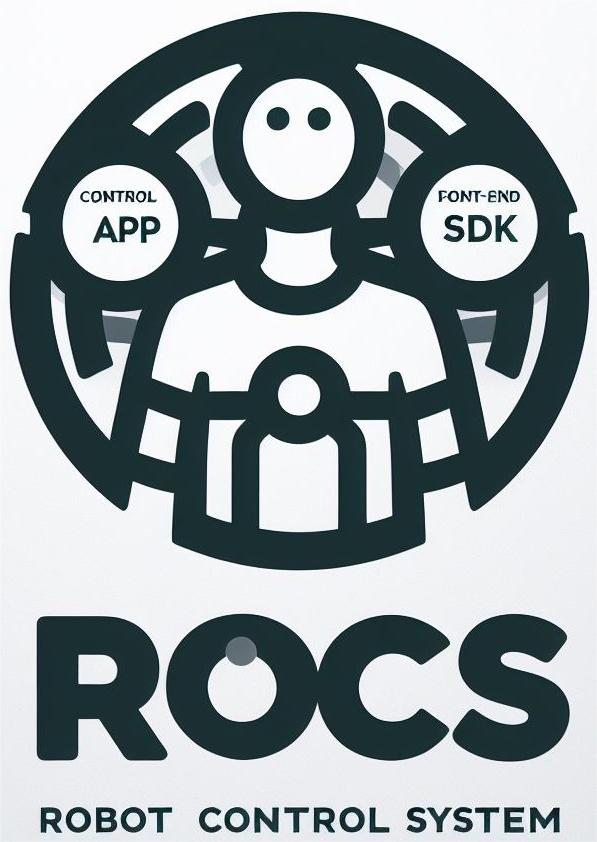

# RoCS server

## In virutal environment (Webots)


The Virtual environment needs Ubuntu OS. >= Ubuntu 20 is OK.

### I. Download Webots
1. Download Webots 2023b from https://www.cyberbotics.com/  
2. Save it under `rocs_server/` folder
3. Name it to `webots_2023b_amd64.deb` if not was.

### II. Download RoCS binary

1. Download `bin.zip` and `lib.zip` from [release page](https://github.com/FFTAI/rocs_server/releases/tag/v1.1.0)
2. unzip them into `rocs_server/` folder
3. The directory structure should be like this:

``` 
rocs_server/
├── bin/
│   ├── joystick/
│   ├── sdk/
│   └── webots/
├── lib/
│   ├── eigen/
│   ├── qpOASES/
│   └── rbdl/
├── install_RoCS.sh
├── README.md (this file)
└── webots_2023b_amd64.deb
```
### III. Install the server environments and dependencies

```shell
sh install_RoCS.sh
```

### IV. Starting the RoCS server

### 1. Load Webots model
1. open Webots
2. `file` -> `open world` -> `rocs_server/`/bin/webots/webotsim/worlds/SonnyV4.wbt


### 2. Starting RoCS server

```shell
sh start_RoCS_server_sdk.sh
```

## V. Usage - by Remote app.

### Download the Remote app. 
On Windows computer  
https://github.com/FFTAI/gros_app/releases

Double click to install it.  
Run it.

## VI. Useage - by gamepad.
### Control by XBox gamepad directly

Connect the gamepad to computer by USB.

```shell
sh start_RoCS_server_jotstick.sh
```


## VII. Development Documentation  
[RoCS platform Doc](http://fftai.github.io/)   
[Python SDK Doc](https://fftai.github.io/docs/sdk_py/)  
[javascript SDK Doc](https://fftai.github.io/docs/sdk_js/)  

