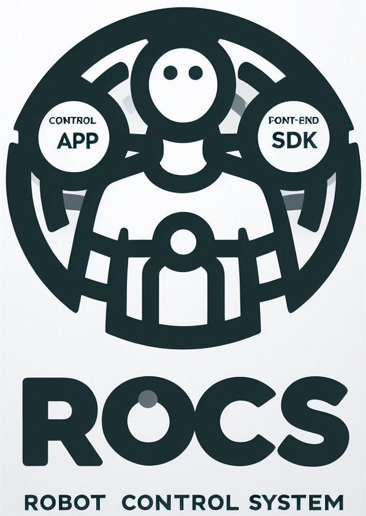

<p align="center">
    <a href="https://fftai.github.io" target="_blank" rel="noopener noreferrer">
        
    </a>
</p>

[中文](./readme_zh_cn.md) | English

# About RoCS

As one of the three main components of RoCS, the server acts as a conduit between the lower computer and upper computer. To establish the RoCS environment to control robot, you'll need to start by installing the server. Following that, you can proceed to install either the SDK or the Control APP, depending on your requirements for interacting with the server and controlling the robot.

For the use of Client SDK to control robot after installing server, please refer to SDK setup section in [SDK](https://github.com/FFTAI/fftai.github.io/blob/main/docs/quick_start/setup_for_physical_robot.md).

For the usage of Control APP, please refer to [Remote Control APP Developer Guide](https://github.com/FFTAI/fftai.github.io/blob/main/docs/demo_app/app_project_setup.md)

___
**We have encapsulated 5 deb installation packages for the RoCS robot control system, which are:**

### rocs-lib
`rocs-libs` It is a library that the RoCS system depends on and contains all the environment dependencies required for runtime.

### rocs-svr
`rocs-svr` essentially serves as the bridge between the upper computer and the lower computer. It is automatially started as a service during booting. It handles commands originating from the upper computer, which can be a Control APP user interface or SDK control programs. Its primary function is to process these commands and transmit control instructions to the lower computer using underlying communication protocols. This intricate communication mechanism enables the achievement of precise control over the robot's movements.

### rocs-wifi
`rocs-wifi` is a crucial component in the RoCS system, responsible for managing and configuring the robot's Wi-Fi connection, including configuring and activating Wi-Fi functionalities. Through this component, it ensures a seamless connection to the Wi-Fi network where the robot is located. It is automatially started as a service during booting.

### rocs-webots
`rocs-webots` is a simulation environment based on Webots, an open source robot simulation application from `Cyberbotics`. Before interacting with a robot directly, we strongly recommend that you first experience it in a Webots simulation environment to become familiar with its operation and use. The simulation environment faithfully replicates the robot's kinematic characteristics and structure, making it an important preliminary step. This package is only installed for simulated environments

### rocs-control
`rocs-control` is the core component of the RoCS system, and we provide a binary file that operates within the '~/RoCS' directory of the embedded robot computer. If you need to fine-tune and customize configuration settings, which may include PID, mass, filtering, and other parameters of the robot, you can achieve this by manually editing the configuration file. This approach allows for precise control of the robot's behavior.

# Quick Installer

## System Requirements

Before proceeding with the RoCS Server installation, ensure that your system meets the following requirements:

* A PC with a minimum dual-core CPU clock speed of 2 GHz and 2 GB of RAM.
* Operating system: Ubuntu(amd64) Long Term Support (LTS) releases, including versions 22.04 and 20.04.
* An NVIDIA or AMD OpenGL-capable graphics adapter with a minimum version of 3.3 and at least 512 MB of RAM.

## A key installation

**For the robot control system, we provide two sets of quick installation scripts for runtime environments and binary files, respectively:** 

1. Simulation environment (based on webots)
    ```shell
    curl -o- https://raw.githubusercontent.com/FFTAI/rocs_server/main/install-simulated.sh | bash
    ```
   
2. Physics-based robot (GR-1)

    ```shell
    curl -o- https://raw.githubusercontent.com/FFTAI/rocs_server/main/install-physical.sh | bash
    ```

## Verifying Installation

To confirm the successful installation of RoCS server packages, open a terminal and run the following command to check if RoCS-related packages are installed:

### Simulation environment
```shell
fftai@fftai-rocs-machine:~$ dpkg -l | grep rocs
ii  rocs-lib            1.0   all     Installs the libraries required by RoCS
ii  rocs-svr            1.3   all     Provides export call services for robot algorithm programs
ii  rocs-webots         1.3   all     Provides a Webots simulation environment model
```

### Physics-based robot
```shell
fftai@gr123ot0001:~$ dpkg -l | grep rocs
ii  rocs-lib            1.0   all     Installs the libraries required by RoCS
ii  rocs-svr            1.3   all     Provides export call services for robot algorithm programs
ii  rocs-wifi           1.0   all     
ii  rocs-control        1.4   all     
```

## Manual Service Control

In certain situations, you may need to manually start or stop RoCS services. Follow the instructions below to perform these actions:

* Manual start the `rocs-svr` service:

```shell
sudo systemctl start rocs_svr.service
```

* Manual stop `rocs-svr` service:

```shell
sudo systemctl stop rocs-svr.service
```

## View Service Logs

To monitor the logs of RoCS services for troubleshooting or debugging purposes, follow these steps:

* Monitor the log of `rocs-svr`:

```shell
tail -f /var/log/syslog | grep rocs
```

!> Userful Tip: Open a terminal and run the command `tail -f /var/log/syslog | grep rocs` to monitor the server log in real time. Keeping the terminal window always on top can provide a convenient way to stay updated.


# Quick Use

## Run in simulation environment (Webots)

### I. Download Webots

1. Execute script for quick installation
   ```shell
   wget https://github.com/cyberbotics/webots/releases/download/R2023b/webots_2023b_amd64.deb
   
   sudo dpkg -i webots_2023b_amd64.deb
   ```

2. Or you can visit the [Cyberbotics](https://www.cyberbotics.com/) official website to download your preferred desktop distribution.

### II. Load Webots Model

1. Open a terminal and run the `webots` command to start Webots GUI interface.
2. `file` -> `open world` -> `～/RoCS/webots/worlds/SonnyV4.wbt`

### III. Control Model
1. Install the client SDK of the corresponding language: [Python](https://pypi.org/project/rocs-client/) or [JavaScript/TypeScript](https://www.npmjs.com/package/rocs-client).
2. You can see the corresponding sample code on the SDK introduction page and control it through the SDK sample code.


## Run in Physical Robot

Based on the real machine operation of the physical robot, several startup items will be created after the quick installation script is successfully run. You only need to ensure that the robot is started correctly and then powered on. In contrast, through the SDK or Android Apk control program we provide - Fourier GR1 Start your robotics experience!


## Portal

### Documentation description
[RoCS Doc](http://fftai.github.io/)   
[Python SDK Doc](https://fftai.github.io/docs/sdk_py/)  
[Javascript SDK Doc](https://fftai.github.io/docs/sdk_js/)  

### Control App
[Fourier GR1.apk](https://github.com/FFTAI/rocs_app/releases/download/v1.1/ROCS-App-1.1.30.apk)

