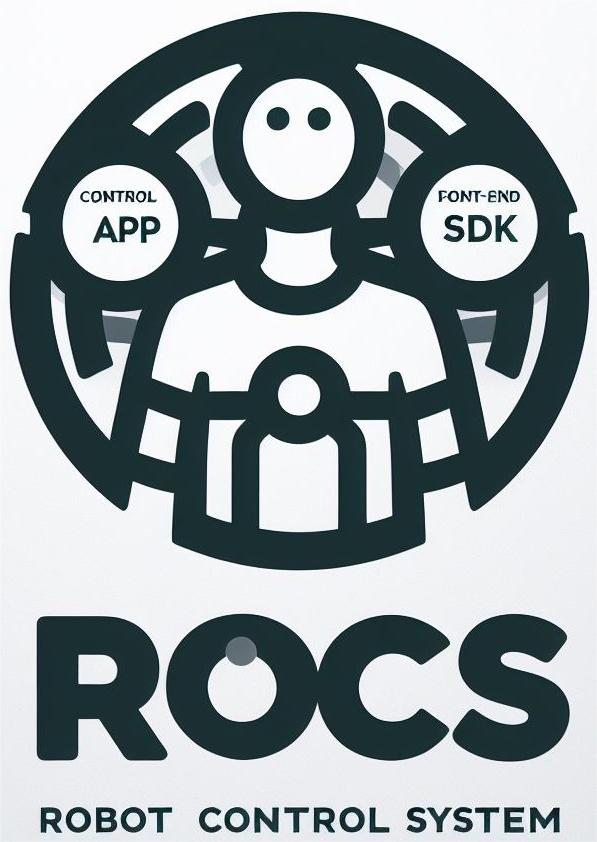

<p align="center">
    <a href="https://fftai.github.io" target="_blank" rel="noopener noreferrer">
        
    </a>
</p>

[English](./readme.md) | 中文

# 关于RoCS机器人控制系统

作为RoCS的三个主要组成部分之一，服务器充当了连接下位机和上位机的通道。要建立控制机器人的RoCS环境，首先需要安装服务器。之后，您可以继续安装SDK或Control APP，这取决于您与服务器交互和控制机器人的要求。

安装服务器后使用客户端SDK控制机器人，请参考[SDK使用说明](https://github.com/FFTAI/fftai.github.io/blob/main/docs/quick_start/setup_for_physical_robot.md)

控制APP的使用方法请参考[远程控制APP开发者指南](https://github.com/FFTAI/fftai.github.io/blob/main/docs/demo_app/app_project_setup.md)

---
**我们对RoCS机器人控制系统进行封装了5个deb的安装包，分别为:** 

### rocs-lib

`rocs-libs` are the libraries that the RoCS system relies on. It provides essential features to:

* Conduct rigid body dynamics computations, facilitating precise modeling of the robot's physical movements.
* Tackle quadratic programming (QP) problems efficiently, enabling the robot's control system to address complex optimization tasks.
* Perform various linear algebra operations, serving as the mathematical foundation for critical robot functionalities.

### rocs-svr

The `rocs-svr` essentially serves as the bridge between the upper computer and the lower computer. It is automatially started as a service during booting. It handles commands originating from the upper computer, which can be a Control APP user interface or SDK control programs. Its primary function is to process these commands and transmit control instructions to the lower computer using underlying communication protocols. This intricate communication mechanism enables the achievement of precise control over the robot's movements.

### rocs-wifi

`rocs-wifi` is a crucial component in the RoCS system, responsible for managing and configuring the robot's Wi-Fi connection, including configuring and activating Wi-Fi functionalities. Through this component, it ensures a seamless connection to the Wi-Fi network where the robot is located. It is automatially started as a service during booting.

### rocs-webots

`rocs-webots` is a simulation environment based on Webots, an open source robot simulation application from Cyberbotics. Prior to interacting directly with the robot, we strongly recommend that you gain familiarity with its operation and usage by first experiencing it within the Webots simulation environment. This simulation environment faithfully replicates the motion characteristics and structure of the robot, making it an essential preliminary step. This pacakge is installed only for the simulation environment.

### rocs-control

`rocs-control` is the core component of the RoCS system, and we provide a binary file that operates within the '~/RoCS' directory of the embedded robot computer. If you need to fine-tune and customize configuration settings, which may include PID, mass, filtering, and other parameters of the robot, you can achieve this by manually editing the configuration file. This approach allows for precise control of the robot's behavior.


# 系统环境

在安装RoCS Server之前，请确保您的系统满足以下要求:

* 具有最低2 GHz双核CPU时钟速度和2 GB RAM的PC。
* 操作系统:Ubuntu长期支持(LTS)版本，包括22.04和20.04版本。
* NVIDIA或AMD支持opengl的图形适配器，最低版本为3.3，内存至少为512 MB。

# 快速安装

对于机器人控制系统我们提供了两套运行时环境和二进制文件，分别为： 

1. 基于物理机器人
2. 基于webots仿真环境

## 物理环境
```shell
curl -o- https://raw.githubusercontent.com/FFTAI/rocs_server/main/install-physical.sh | bash
```

## 仿真环境
```shell
curl -o- https://raw.githubusercontent.com/FFTAI/rocs_server/main/install-simulated.sh | bash
```

## 检查有效性

`rocs-svr` services have been configured for automatic startup during the boot process. After the installation is finished, it's crucial to confirm that these services indeed start automatically as intended.

```shell
sudo systemctl status rocs-svr.service
```

## Manual Service Control

In certain situations, you may need to manually start or stop RoCS services. Follow the instructions below to perform these actions:

* Manual start the `rocs-svr` service:

```shell
sudo systemctl start rocs_svr.service
```

* Manual stop `rocs-svr` service:

```shell
sudo systemctl stop rocs-svr.service
```

## View Service Logs

To monitor the logs of RoCS services for troubleshooting or debugging purposes, follow these steps:

* Monitor the log of `rocs-svr`:

```shell
tail -f /var/log/syslog | grep rocs
```

!> Userful Tip: Open a terminal and run the command `tail -f /var/log/syslog | grep rocs` to monitor the server log in real time. Keeping the terminal window always on top can provide a convenient way to stay updated.


# 上手使用

## 在仿真环境运行 (Webots)

### I. 下载Webots

1. 执行脚本快速安装
```shell
wget https://github.com/cyberbotics/webots/releases/download/R2023b/webots_2023b_amd64.deb

sudo dpkg -i webots_2023b_amd64.deb
```

2. 或者您也可以访问[cyberbotics](https://www.cyberbotics.com/)官网网站下载您偏好的桌面发行版 

### II. 加载Webots模型
1. 打开Webots
2. `file` -> `open world` -> `～/RoCS/webots/worlds/SonnyV4.wbt`

### III. 控制模型
1. 安装对应语言的client SDK: [Python](https://pypi.org/project/rocs-client/) 或 [JavaScript/TypeScript]().
2. 您可以在sdk的介绍页面看到相应的示例代码，通过SDK示例代码进行操控

## 在真实机器运行

基于物理机器人的真机运行，在快速安装脚本运行成功之后会创建几个开机启动项，您只需要确保机器人的初始位置准确后开机上电，便可通过我们提供的SDK或安卓Apk控制程序-Fourier GR1 开始您的机器人体验！


## 传送门

### 文档说明
[RoCS platform Doc](http://fftai.github.io/)   
[Python SDK Doc](https://fftai.github.io/docs/sdk_py/)  
[javascript SDK Doc](https://fftai.github.io/docs/sdk_js/)  

### 控制App
[Fourier GR1.apk](https://github.com/FFTAI/rocs_app/releases/download/v1.1/ROCS-App-1.1.30.apk)
